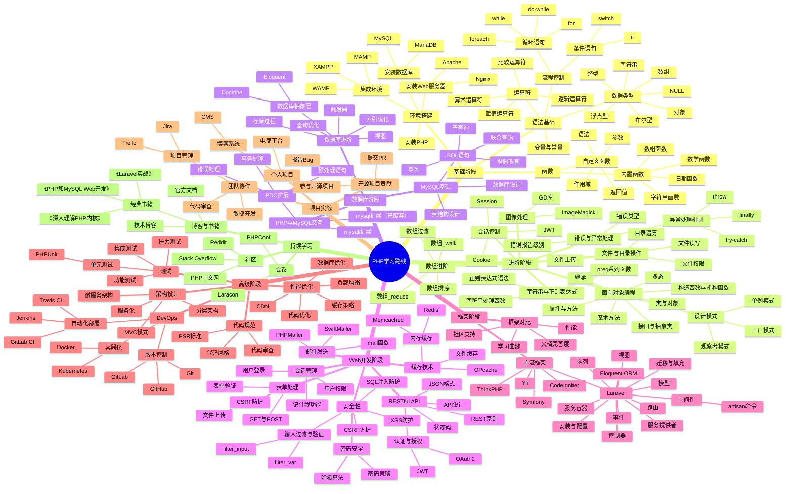

PHP学习资料

这个仓库是我自己准备了，最近准备就业，然后打算系统性的重温一遍PHP，然后这里就合集了一些我重温PHP需要用到的资料、网站，可能还会有一些我的笔记啊什么的。

网站汇集
- PHP官网：[https://www.php.net/](https://www.php.net/)
- PHP的Github主页：[https://github.com/php](https://github.com/php)
- PHP的Github官方仓库：[https://github.com/php/php-src](https://github.com/php/php-src)
- PHP官方文档：[https://www.php.net/docs.php](https://www.php.net/docs.php)
- 什么是PHP 知乎： [https://zhuanlan.zhihu.com/p/24779852](https://zhuanlan.zhihu.com/p/24779852)
- 菜鸟教程PHP教程：[https://www.runoob.com/php/php-tutorial.html](https://www.runoob.com/php/php-tutorial.html)
- W3school的PHP教程：[https://www.w3school.com.cn/php/index.asp](https://www.w3school.com.cn/php/index.asp)
- 慕课网PHP入门篇：[https://m.imooc.com/learn/54](https://m.imooc.com/learn/54)
- PHP交流论坛：[https://learnku.com/php](https://learnku.com/php)
- PHP The Right Way：[https://phptherightway.com/](https://phptherightway.com/)
- PHP Internals Book：[https://www.phpinternalsbook.com/](https://www.phpinternalsbook.com/)
- Zend OPCache 官方调优手册：[https://www.php.net/manual/en/opcache.configuration.php](https://www.php.net/manual/en/opcache.configuration.php)
- PHP中文官方论坛：[https://www.php.cn](https://www.php.cn)
- ThinkPHP 生态论坛：[https://q.thinkphp.cn](https://q.thinkphp.cn)
- Laravel China / 中文文档：[https://learnku.com/laravel](https://learnku.com/laravel)
- PHP Sandbox：[https://3v4l.org](https://3v4l.org)
- Codecademy PHP 课：[https://www.codecademy.com/learn/learn-php](https://www.codecademy.com/learn/learn-php)
- Xdebug 官方教程合集：[https://xdebug.org/docs](https://xdebug.org/docs)
- PHPStan Playground：[https://phpstan.org/try](https://phpstan.org/try)
- Psalm Playground：[https://psalm.dev](https://psalm.dev)
- Symfony Cast：[https://symfonycasts.com](https://symfonycasts.com)
- Hyperf 官方文档：[https://hyperf.wiki](https://hyperf.wiki)
- PHP Watch：[https://php.watch](https://php.watch)
- Composer 官方优化指南：[https://getcomposer.org/doc/articles/autoloader-optimization.md](https://getcomposer.org/doc/articles/autoloader-optimization.md)
- LeetCode PHP 标签：[https://leetcode.com/tag/php](https://leetcode.com/tag/php)
- 牛客网《PHP 工程师笔试面经》专栏：[https://www.nowcoder.com/discuss?type=7&order=0](https://www.nowcoder.com/discuss?type=7&order=0)
- 7.88GB视频课程 链接:https://pan.baidu.com/s/1rQHiSo6c3uuoIQXbeFIyog 提取码:786h

## PHP项目推荐

- ThinkPHP：[https://github.com/top-think/framework](https://github.com/top-think/framework)
- Laravel：[https://github.com/laravel/laravel](https://github.com/laravel/laravel)  
- Symfony：[https://github.com/symfony/symfony](https://github.com/symfony/symfony)  
- CodeIgniter：[https://github.com/codeigniter4/CodeIgniter4](https://github.com/codeigniter4/CodeIgniter4)  
- Yii2：[https://github.com/yiisoft/yii2](https://github.com/yiisoft/yii2)  
- Hyperf：[https://github.com/hyperf/hyperf](https://github.com/hyperf/hyperf)  
- Swoole：[https://github.com/swoole/swoole-src](https://github.com/swoole/swoole-src)  
- EasySwoole：[https://github.com/easy-swoole/easyswoole](https://github.com/easy-swoole/easyswoole)  
- MixPHP：[https://github.com/mix-php/mix](https://github.com/mix-php/mix)  
- OneBase：[https://github.com/onebase/onebase](https://github.com/onebase/onebase)  
- FastAdmin：[https://github.com/karsonzhang/fastadmin](https://github.com/karsonzhang/fastadmin)  
- coolify：[https://github.com/coollabsio/coolify](https://github.com/coollabsio/coolify)  
- filament：[https://github.com/filamentphp/filament](https://github.com/filamentphp/filament)  
- Faker：[https://github.com/fzaninotto/Faker](https://github.com/fzaninotto/Faker)  
- Monica：[https://github.com/monicahq/monica](https://github.com/monicahq/monica)  
- Guzzle：[https://github.com/guzzle/guzzle](https://github.com/guzzle/guzzle)  
- Livewire：[https://github.com/livewire/livewire](https://github.com/livewire/livewire)  
- Bagisto：[https://github.com/bagisto/bagisto](https://github.com/bagisto/bagisto)  
- DesignPatternsPHP：[https://github.com/DesignPatternsPHP/DesignPatternsPHP](https://github.com/DesignPatternsPHP/DesignPatternsPHP)  
- PHPMailer：[https://github.com/PHPMailer/PHPMailer](https://github.com/PHPMailer/PHPMailer)  
- Monolog：[https://github.com/Seldaek/monolog](https://github.com/Seldaek/monolog)  
- Matomo：[https://github.com/matomo-org/matomo](https://github.com/matomo-org/matomo)  
- Firefly III：[https://github.com/firefly-iii/firefly-iii](https://github.com/firefly-iii/firefly-iii)  
- WordPress：[https://github.com/WordPress/WordPress](https://github.com/WordPress/WordPress)  
- PHPUnit：[https://github.com/sebastianbergmann/phpunit](https://github.com/sebastianbergmann/phpunit)  
- Krayin CRM：[https://github.com/krayin/laravel-crm](https://github.com/krayin/laravel-crm)  
- Laravel Debugbar：[https://github.com/barryvdh/laravel-debugbar](https://github.com/barryvdh/laravel-debugbar)  
- CodeIgniter（旧版）：[https://github.com/bcit-ci/CodeIgniter](https://github.com/bcit-ci/CodeIgniter)  
- BookStack：[https://github.com/BookStackApp/BookStack](https://github.com/BookStackApp/BookStack)  
- PHP-Parser：[https://github.com/nikic/PHP-Parser](https://github.com/nikic/PHP-Parser)  
- Koel：[https://github.com/koel/koel](https://github.com/koel/koel)  
- Carbon：[https://github.com/briannesbitt/Carbon](https://github.com/briannesbitt/Carbon)  
- Flarum：[https://github.com/flarum/flarum](https://github.com/flarum/flarum)  
- Grav：[https://github.com/getgrav/grav](https://github.com/getgrav/grav)  
- Parsedown：[https://github.com/erusev/parsedown](https://github.com/erusev/parsedown)  
- Laravel IDE Helper：[https://github.com/barryvdh/laravel-ide-helper](https://github.com/barryvdh/laravel-ide-helper)  
- Cachet：[https://github.com/cachethq/cachet](https://github.com/cachethq/cachet)  
- Intervention Image：[https://github.com/Intervention/image](https://github.com/Intervention/image)  
- PhpSpreadsheet：[https://github.com/PHPOffice/PhpSpreadsheet](https://github.com/PHPOffice/PhpSpreadsheet)  
- PHPStan：[https://github.com/phpstan/phpstan](https://github.com/phpstan/phpstan)  
- LibreSpeed Speedtest：[https://github.com/librespeed/speedtest](https://github.com/librespeed/speedtest)  
- Flysystem：[https://github.com/thephpleague/flysystem](https://github.com/thephpleague/flysystem)  
- PHPDotEnv：[https://github.com/vlucas/phpdotenv](https://github.com/vlucas/phpdotenv)  
- PHP-CS-Fixer：[https://github.com/PHP-CS-Fixer/PHP-CS-Fixer](https://github.com/PHP-CS-Fixer/PHP-CS-Fixer)  
- Whoops：[https://github.com/filp/whoops](https://github.com/filp/whoops)  
- Sage（WordPress）：[https://github.com/roots/sage](https://github.com/roots/sage)  
- Snipe-IT：[https://github.com/grokability/snipe-it](https://github.com/grokability/snipe-it)  
- Laravel Permission：[https://github.com/spatie/laravel-permission](https://github.com/spatie/laravel-permission)  
- Ramsey UUID：[https://github.com/ramsey/uuid](https://github.com/ramsey/uuid)  
- FreshRSS：[https://github.com/FreshRSS/FreshRSS](https://github.com/FreshRSS/FreshRSS)  
- Laravel Excel：[https://github.com/SpartnerNL/Laravel-Excel](https://github.com/SpartnerNL/Laravel-Excel)  
- Clean Code PHP：[https://github.com/piotrplenik/clean-code-php](https://github.com/piotrplenik/clean-code-php)
- slim：[https://github.com/slimphp/Slim](https://github.com/slimphp/Slim)

## 学习路线

## Github上的开源面试题 & 刷题集
- PHP 面试题集（含答案）：
    - [colinlet/PHP-Interview-QA](https://github.com/colinlet/PHP-Interview-QA)
    - [CoderOpen/PHPSeniorInterview](https://github.com/CoderOpen/PHPSeniorInterview)
    - [nonfu/php_interviews](https://github.com/nonfu/php_interviews)
    - [yefangyong/PHP-Interview](https://github.com/yefangyong/PHP-Interview)
    - [wanglelecc/interview](https://github.com/wanglelecc/interview)
    - [lengyue1024/BAT_interviews – PHP 面试题及答案](https://github.com/lengyue1024/BAT_interviews/blob/master/PHP%E9%9D%A2%E8%AF%95%E9%A2%98%E5%8F%8A%E7%AD%94%E6%A1%88.md)
    - [rucblake/php-be-interview](https://github.com/rucblake/php-be-interview)
    - [ycrao/mynotes](https://github.com/ycrao/mynotes)
    - [walijoy/php-engineer-interview-questions](https://github.com/walijoy/php-engineer-interview-questions)
    - [zhaopan/DevStandard](https://github.com/zhaopan/DevStandard)
    - [ucdo/problem – PHP](https://github.com/ucdo/problem/tree/main/PHP)
    - [aa24615/phpIQ](https://github.com/aa24615/phpIQ)